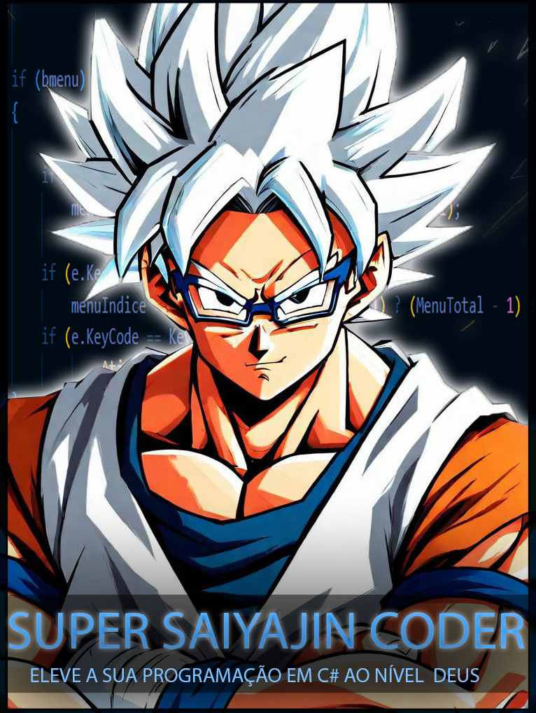

    

-------

# Projeto EBOOK Gerado por I.A.s

 > ℹ️ **NOTE:** Este é o repositório desenvolvido durante o curso no qual fui instrutor técnico na plataforma da [DIO](https://dio.me)

Projeto com o objetivo de gerar um ebook digital com as facilidades das ferramentas de IA. todos os prompts
seguem abaixo.

<a href="https://github.com/CyberJeferson/prompts-recipe-to-create-a-ebook/blob/main/output/Ebook.pdf" title="View PDF now"> 📕Clique aqui para ler</a>

## 💻 Tecnologias utilizadas no projeto

- [ChatGPT](https://chat.openai.com/) 
- [BlueWillow](https://www.bluewillow.ai/)
- [PowerPoint](https://www.microsoft.com/en/microsoft-365/powerpoint)

## 🧠 Prompts

ChatGPT：

|   Ação   | prompt                                                                                                                                                                                                                                                                         |
| :------: | ------------------------------------------------------------------------------------------------------------------------------------------------------------------------------------------------------------------------------------------------------------------------------ |
|  título  |traz sugestões de título para ebook , o nicho 1 será programação e o 2 será C#  usando a analogias com dragon ball super |
| conteúdo | Faça um texto para ebook, com foco em melhorar as técnicas de C#, listando os principais métodos e fale também sobre operadores ternários e Linq e os métodos,tryparse,String.IsNullOrEmpty,Substring,IndexOf,Split e Join {REGRAS} Deixe o texto enxuto,Sempre traga exemplo de código em contexto reais,Sempre deixe um título sujestivo para o tópico,Exiba no exemplo seis tópicos|------------------------------------|

BlueWillow：

|  Ação  | prompt                                                                                 |
| :----: | -------------------------------------------------------------------------------------- |
| título | Goku, the Super Saiyan, with white hair, wearing glasses, and with his arms crossed. |

## ✨ Features

- Conteúdo gerado via ChatGPT
- Imagens geradas via BlueWillow

## 📚 Materiais

- Imagens utilizadas em `assets`
- ebook gerado durante as aulas em `output`

## 🛠️ Instruções de execução

Utilize os prompts acima nas ferramentas sugeridas para gerar o material base e utilize uma ferramenta de edição de documentos como power point, libreoffice , indesign para diagramação.

## 👨‍💻 Expert

    
    
Jeferson Oliveira 
    &nbsp&nbsp&nbsp
    <a href="https://github.com/CyberJeferson">
    GitHub</a>&nbsp;|&nbsp;
    <a href="https://www.linkedin.com/in/jeferson-oliveira-8335051b6">LinkedIn
</a>
&nbsp;|&nbsp;

